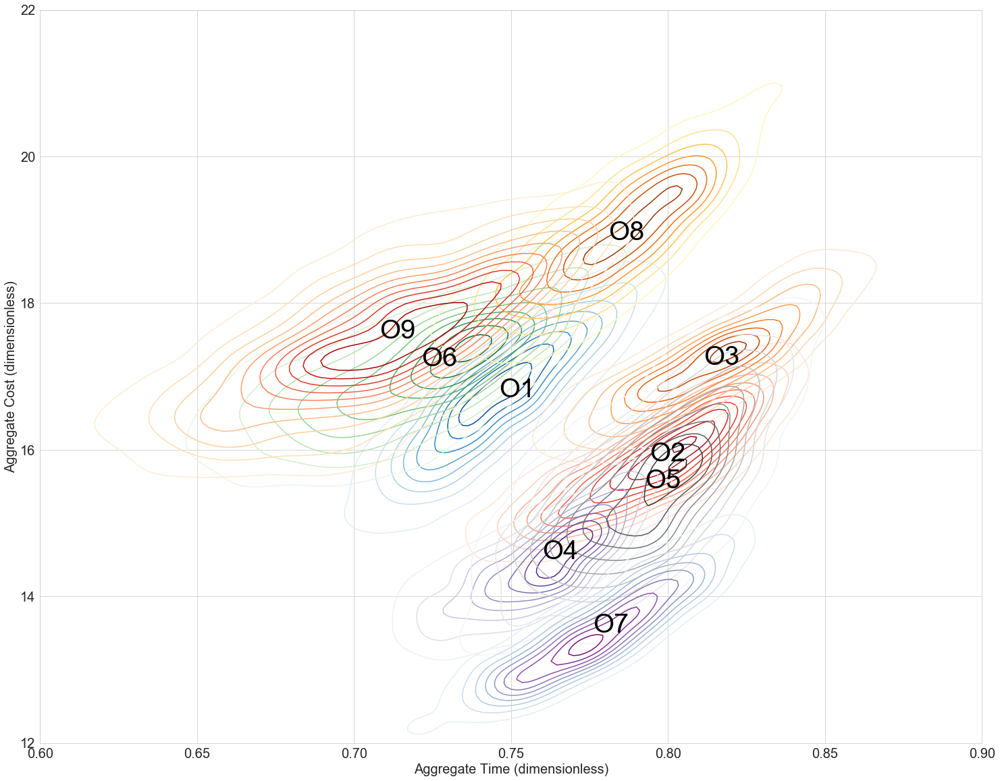

# Data-analysis
A demo of my work focus on data mining and virtualization

# tenbar capital
Research work using data driven analysis to assess, track, and measure ESG/Impact investment outcomes for Tenbar Capital, a firm provides advise to impact and mission driven start-ups

# Organization Complexity Analysis
A complexity analysis based on evaluating a non profit company to hybrid model transition using SVD (singular value decompistion)

# Uncertainly Anlysis on Project Cost and Time by using maonte carlos method
There are two input data point for project evaluation:
  Cost ( how much it cost to implement it? )
  Time ( how long it takes to finish project)
We pick 10 options, with 10 unique values of Cost/Time pair for a project. Then we apply to Probability Density Functions (triangle distribution & normal distribution) to existing decisions. 
Next step, we did Monte Carlos method to convert model point assumptions into probability distributions. We run it 1000 times by sampling random variables each time. From this way, we can see how uncertainty impact existing data.

